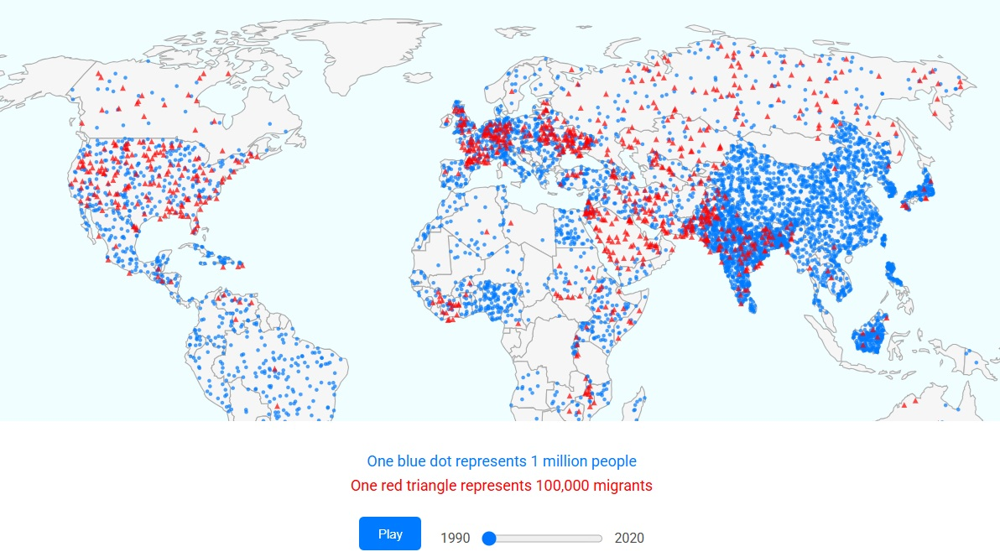
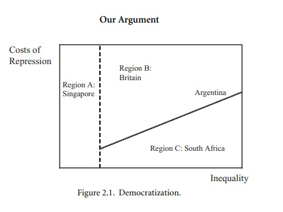

# Jose Pajuelo

## Description

The project follow the narrative developed in the static project. And plan to present them as a single project. Specifically:

• Showing on a map the transitions to democracy or authoritarianism over the years, highlighting the regional dynamics of these transitions.

• Showing that remaining in a given regime type is determined mainly by two factors: inequality and the cost of repression. When the cost of repression is low, regimes can maintain authoritarian rule, especially in societies with low inequality where demands for redistribution are limited. On the other hand, when the cost of repression is high and inequality is low, countries are more likely to remain democratic, as elites prefer inclusive institutions to costly repression. In all other cases, specially when inequality is high, countries tend to experience instability between democratic and authoritarian regimes.

## Technical Plan re: Option A/B/C/D

I am planning to develop Option B, which includes two visualizations:

• A map with a timeline showing the transitions between democracy and authoritarianism over time, emphasizing the regional dynamics of these transitions.

• A map with a timeline that shows how likely countries are to maintain their regime or go into a transition (see mockup). This map will have two dimensions: inequality and cost of repression.

## Mockup

For the fist visualization:

For the second one (with a timeline):

## Data Sources

### Data Source 1: {Name}

• For transitions:
    Center for Systemic Peace. (2018). Polity5 Database: Political regime characteristics and transitions, 1800–2018

    https://www.systemicpeace.org/inscrdata.html

• For inequality: 
    World Development Indicators: Gini Index. The World Bank.

    https://data.worldbank.org/indicator/

• For cost of repression:
    To be found or approximate

## Questions

1. If I cannot obtain data for the cost of repression, would it be acceptable to:

    • Use data for only one year and make it dynamic by implementing filters by region? 

    • If no data are available, summarize the democratic characteristics of countries and make the visualization dynamic by filtering by country?